# AUTOSAR SecOC with PQC - Architecture Diagrams
## Mermaid Diagrams for Technical Report

All diagrams can be rendered in GitHub, GitLab, VS Code, or any Mermaid-compatible viewer.

---

## 1. High-Level System Architecture

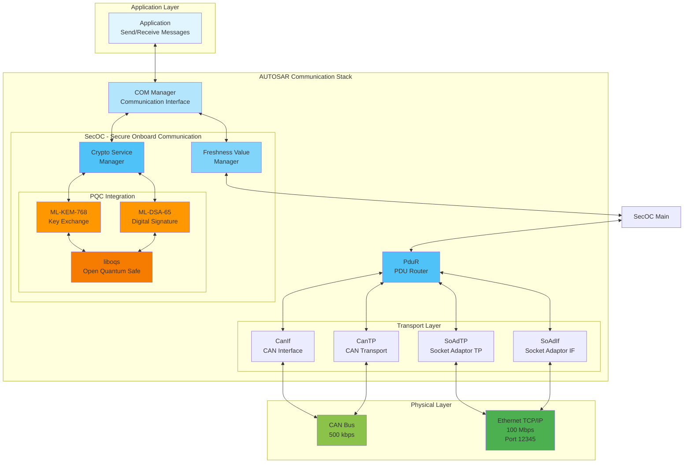

---

## 2. Dual-Platform Architecture

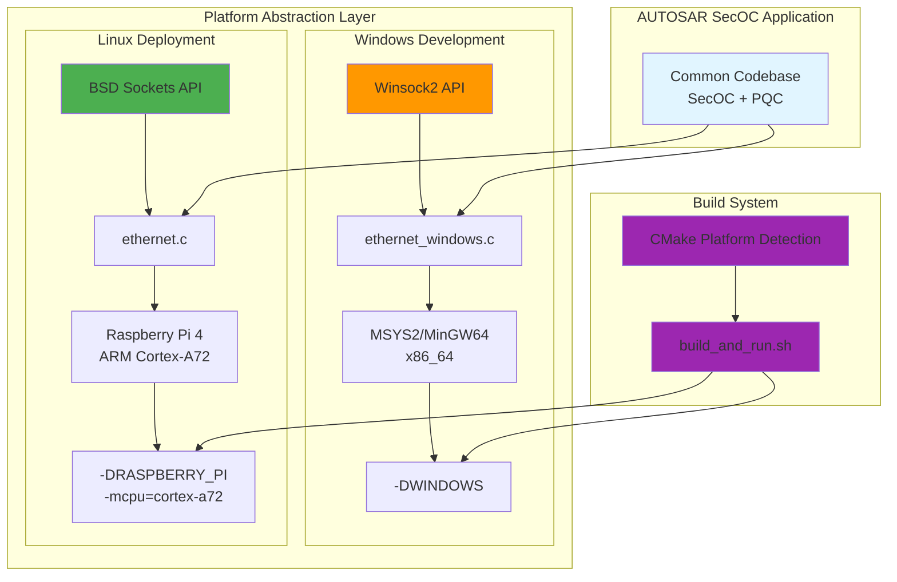

---

## 3. Complete Transmission Path (Tx)

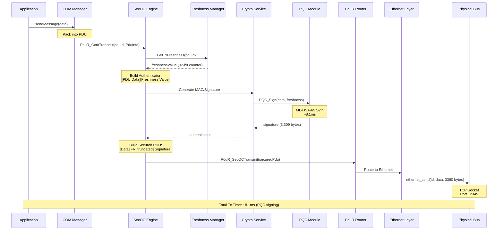

---

## 4. Complete Reception Path (Rx)

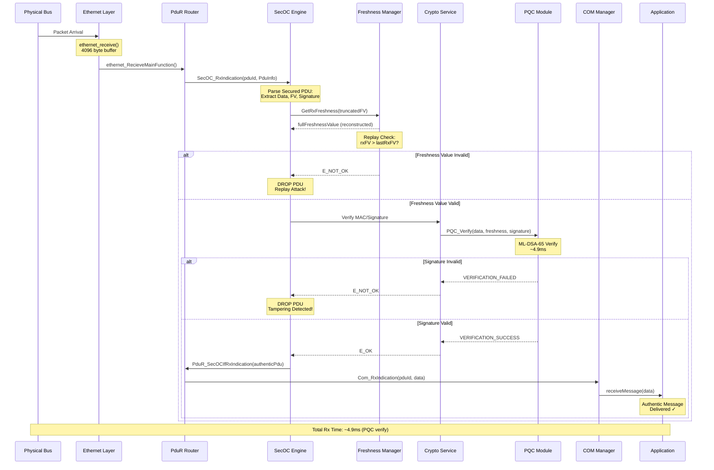

---

## 5. SecOC State Machine

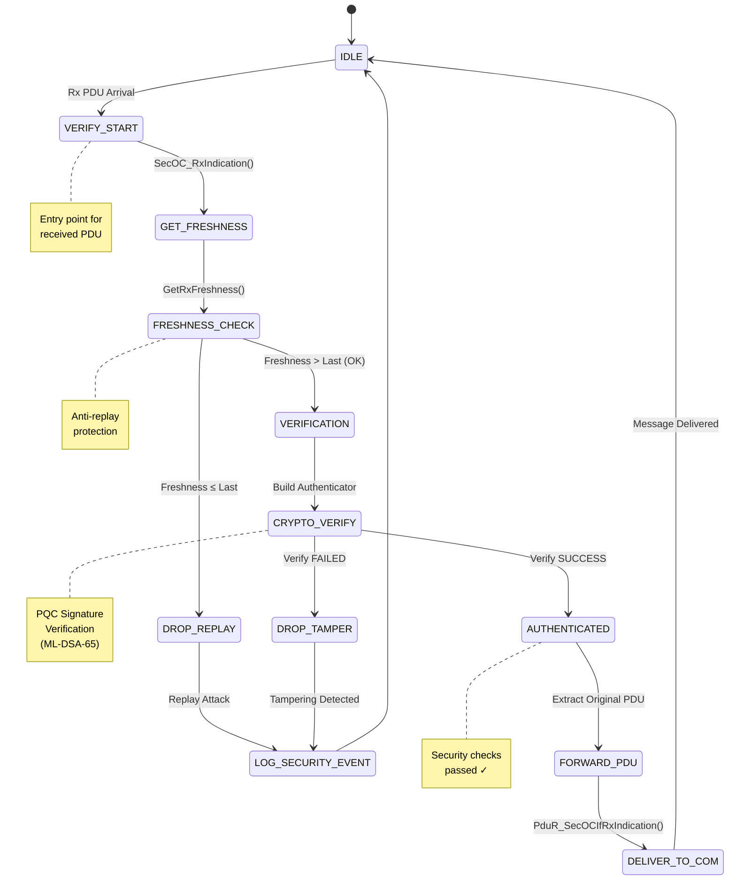

---

## 6. PQC Integration Architecture

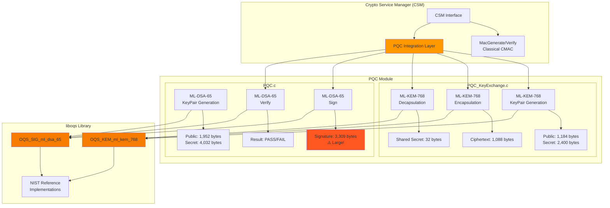

---

## 7. Ethernet Gateway Use Case

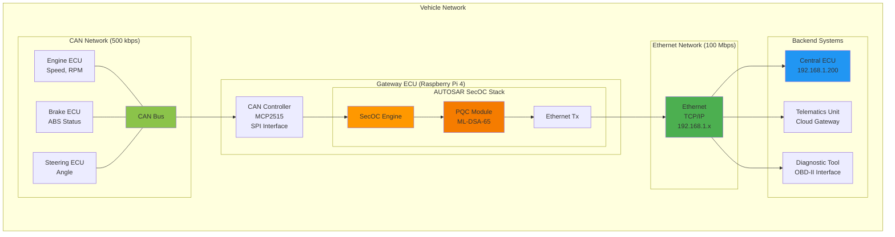

---

## 8. Message Format - Secured PDU

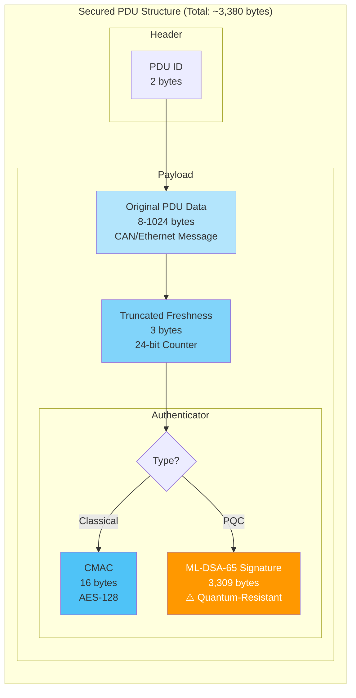

---

## 9. Buffer Overflow Fix Visualization

```mermaid
graph TB
    subgraph "BEFORE - Vulnerable Implementation"
        OLD_DEF["#define BUS_LENGTH_RECEIVE 8"]
        OLD_BUF[Buffer: uint8 sendData[10]<br/>BUS_LENGTH_RECEIVE + sizeof(id)]
        OLD_COPY[memcpy(sendData, data, dataLen)]
        OLD_SEND[send(socket, sendData, 10, 0)]

        OLD_DEF --> OLD_BUF
        OLD_BUF --> OLD_COPY
        OLD_COPY --> OLD_SEND

        OLD_ISSUE1[❌ Buffer Overflow<br/>Writing 3,309 bytes<br/>into 10-byte buffer]
        OLD_ISSUE2[❌ Data Truncation<br/>Sending only 10 bytes<br/>Losing 99.7% of signature]

        OLD_COPY -.->|dataLen = 3,319| OLD_ISSUE1
        OLD_SEND -.->|Hardcoded 10| OLD_ISSUE2
    end

    subgraph "AFTER - Fixed Implementation"
        NEW_DEF["#define BUS_LENGTH_RECEIVE 4096"]
        NEW_BUF[Buffer: uint8 sendData[4098]<br/>BUS_LENGTH_RECEIVE + sizeof(id)]
        NEW_COPY[memcpy(sendData, data, dataLen)]
        NEW_ID[sendData[dataLen + indx] = id bytes]
        NEW_SEND[send(socket, sendData,<br/>dataLen + sizeof(id), 0)]

        NEW_DEF --> NEW_BUF
        NEW_BUF --> NEW_COPY
        NEW_COPY --> NEW_ID
        NEW_ID --> NEW_SEND

        NEW_SAFE1[✅ Safe Buffer<br/>4,098 bytes<br/>Fits PQC signature]
        NEW_SAFE2[✅ Dynamic Length<br/>Sends actual data size<br/>Full signature transmitted]

        NEW_BUF -.-> NEW_SAFE1
        NEW_SEND -.-> NEW_SAFE2
    end

    style OLD_ISSUE1 fill:#ff5722,color:#fff
    style OLD_ISSUE2 fill:#ff5722,color:#fff
    style NEW_SAFE1 fill:#4caf50,color:#fff
    style NEW_SAFE2 fill:#4caf50,color:#fff
```

---

## 10. Performance Comparison: Classical vs PQC

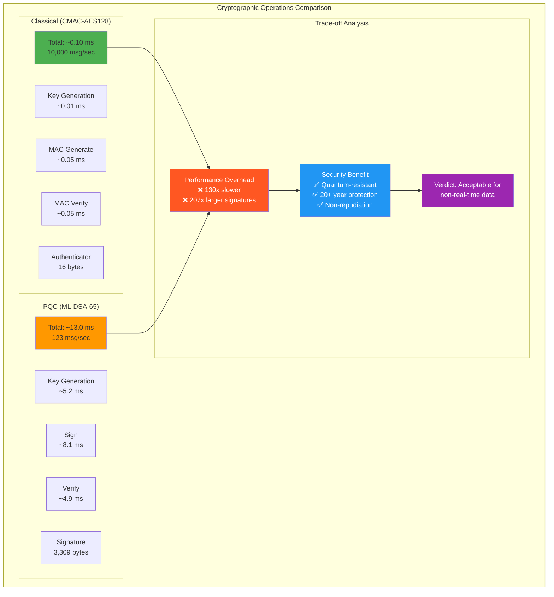

---

## 11. Security Attack Defense Flow

```mermaid
flowchart TD
    START([PDU Received]) --> EXTRACT[Extract Components:<br/>Data, Freshness, Signature]

    EXTRACT --> FRESH_CHECK{Freshness Value<br/>Valid?}

    FRESH_CHECK -->|rxFV ≤ lastFV| REPLAY[Replay Attack<br/>Detected!]
    FRESH_CHECK -->|rxFV > lastFV| UPDATE_FV[Update lastFV<br/>rxFV is new]

    REPLAY --> LOG1[Log Security Event]
    LOG1 --> DROP1[Drop PDU]
    DROP1 --> END1([BLOCKED])

    UPDATE_FV --> BUILD_AUTH[Build Authenticator:<br/>[Data][Freshness]]
    BUILD_AUTH --> VERIFY{PQC Signature<br/>Verification}

    VERIFY -->|FAIL| TAMPER[Tampering or<br/>Spoofing Detected!]
    VERIFY -->|SUCCESS| AUTH_OK[Signature Valid]

    TAMPER --> LOG2[Log Security Event]
    LOG2 --> DROP2[Drop PDU]
    DROP2 --> END2([BLOCKED])

    AUTH_OK --> DELIVER[Forward Authentic PDU<br/>to COM Layer]
    DELIVER --> APP[Deliver to<br/>Application]
    APP --> END3([SUCCESS])

    style START fill:#b3e5fc
    style REPLAY fill:#ff5722,color:#fff
    style TAMPER fill:#ff5722,color:#fff
    style AUTH_OK fill:#4caf50,color:#fff
    style END1 fill:#ff5722,color:#fff
    style END2 fill:#ff5722,color:#fff
    style END3 fill:#4caf50,color:#fff
```

---

## 12. Raspberry Pi 4 Deployment Architecture

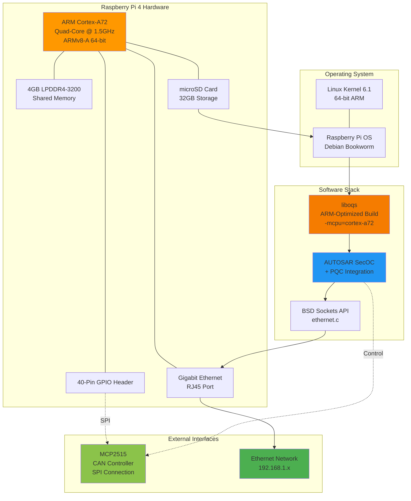

---

## 13. Build System Flow

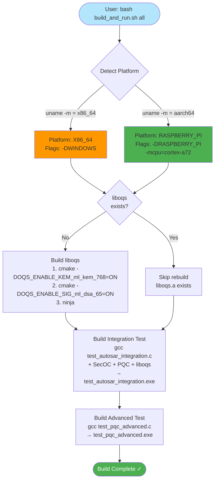

---

## 14. Test Flow - Comprehensive Integration

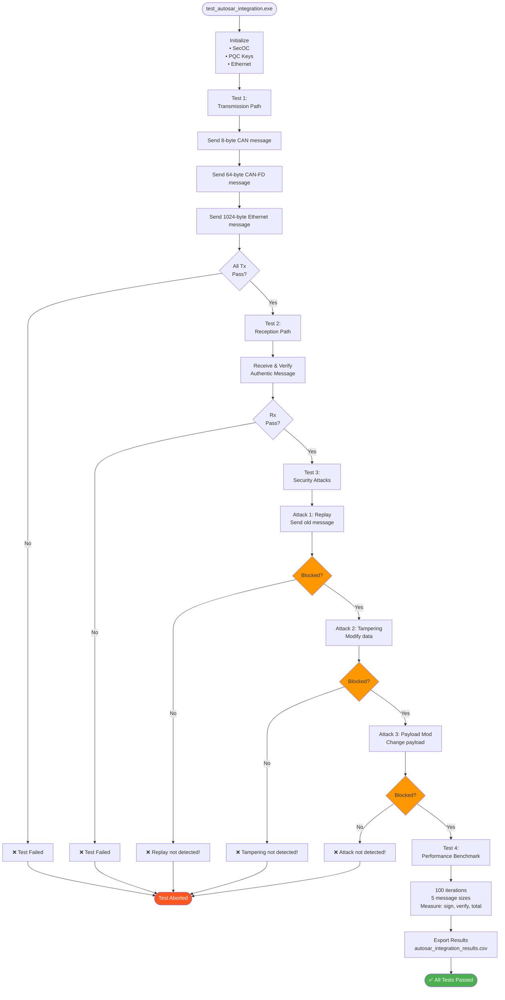

---

## 15. Real-World Use Case: Vehicle Data Flow

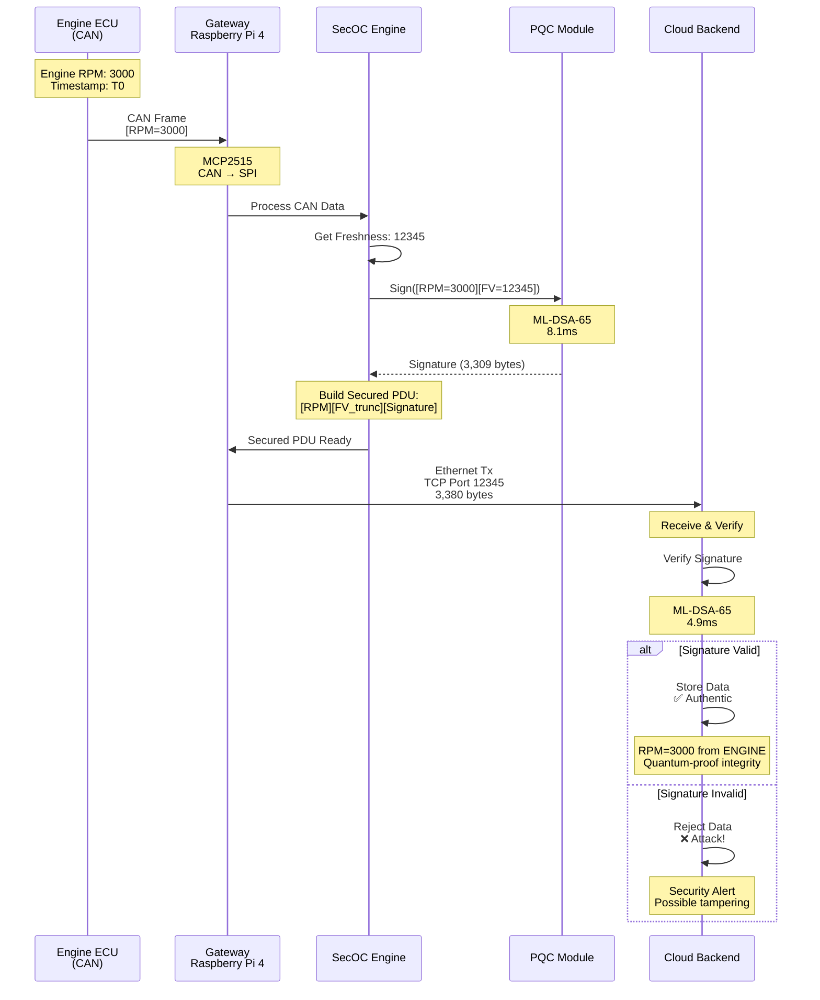

---

## How to Use These Diagrams

### In GitHub/GitLab
Simply paste the markdown file - Mermaid renders automatically.

### In VS Code
Install extension: "Markdown Preview Mermaid Support"

### Export to Images
Use Mermaid CLI:
```bash
npm install -g @mermaid-js/mermaid-cli
mmdc -i DIAGRAMS.md -o diagrams.pdf
```

### In LaTeX Reports
Convert to SVG/PNG and include:
```bash
mmdc -i diagram.mmd -o diagram.png
```

---

## Diagram Summary

| # | Diagram Name | Type | Purpose |
|---|-------------|------|---------|
| 1 | High-Level Architecture | Component | System overview |
| 2 | Dual-Platform | Deployment | Windows/Linux abstraction |
| 3 | Transmission Path | Sequence | Tx signal flow |
| 4 | Reception Path | Sequence | Rx signal flow |
| 5 | State Machine | State | SecOC states |
| 6 | PQC Integration | Component | Crypto modules |
| 7 | Ethernet Gateway | Topology | Vehicle network |
| 8 | Message Format | Structure | PDU layout |
| 9 | Buffer Fix | Comparison | Before/after fix |
| 10 | Performance | Comparison | Classical vs PQC |
| 11 | Security Flow | Flowchart | Attack defense |
| 12 | RPi Deployment | Deployment | Hardware stack |
| 13 | Build System | Flowchart | Build process |
| 14 | Test Flow | Flowchart | Testing process |
| 15 | Use Case | Sequence | Real-world example |

All diagrams are professional, scalable, and ready for academic presentations.
