# AUTOSAR SecOC Ethereum Gateway with PQC - Architecture Diagrams
## Mermaid Diagrams for Technical Report

**Context:** All diagrams emphasize the **Ethernet Gateway** use case with Post-Quantum Cryptography.

---

## 1. Ethernet Gateway System Overview

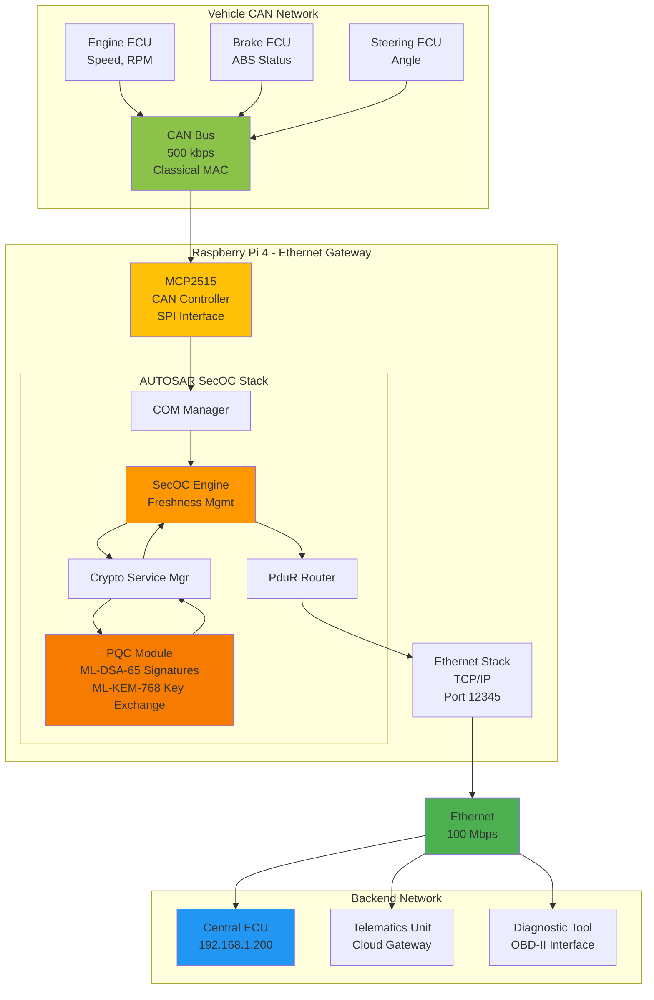

---

## 2. Ethernet Gateway Data Flow (CAN → Ethernet)

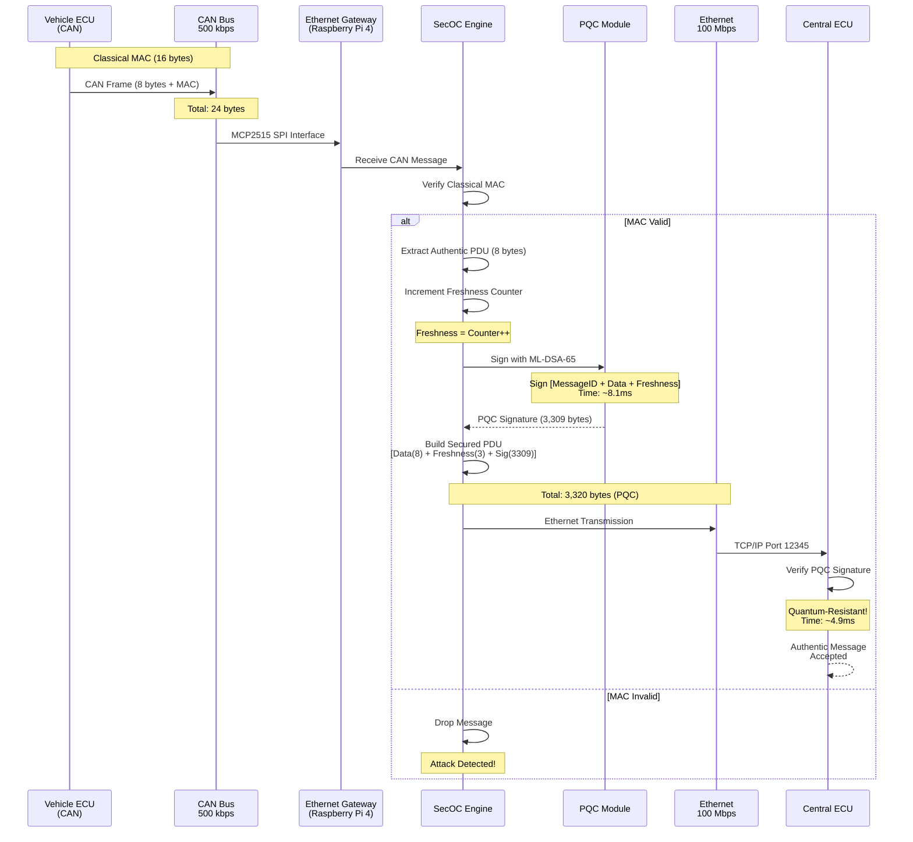

---

## 3. Ethernet Gateway Data Flow (Ethernet → CAN)

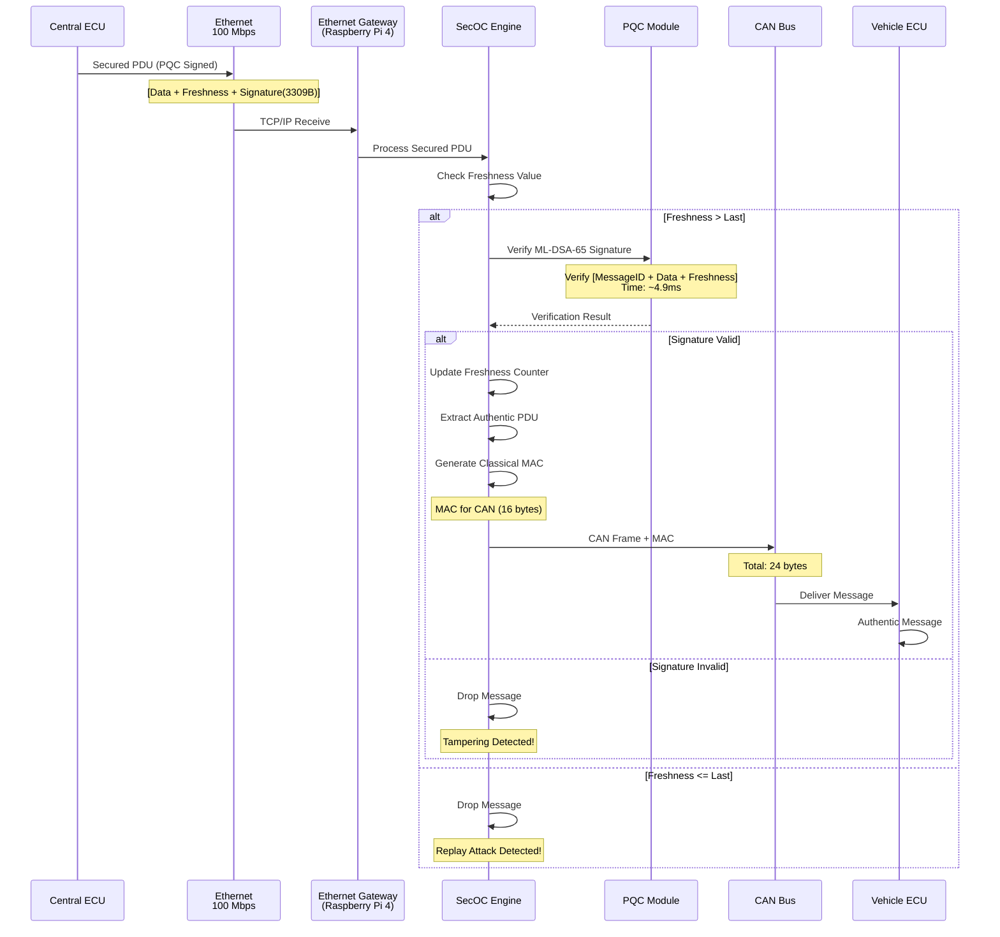

---

## 4. Secured PDU Format Comparison (CAN vs Ethernet)

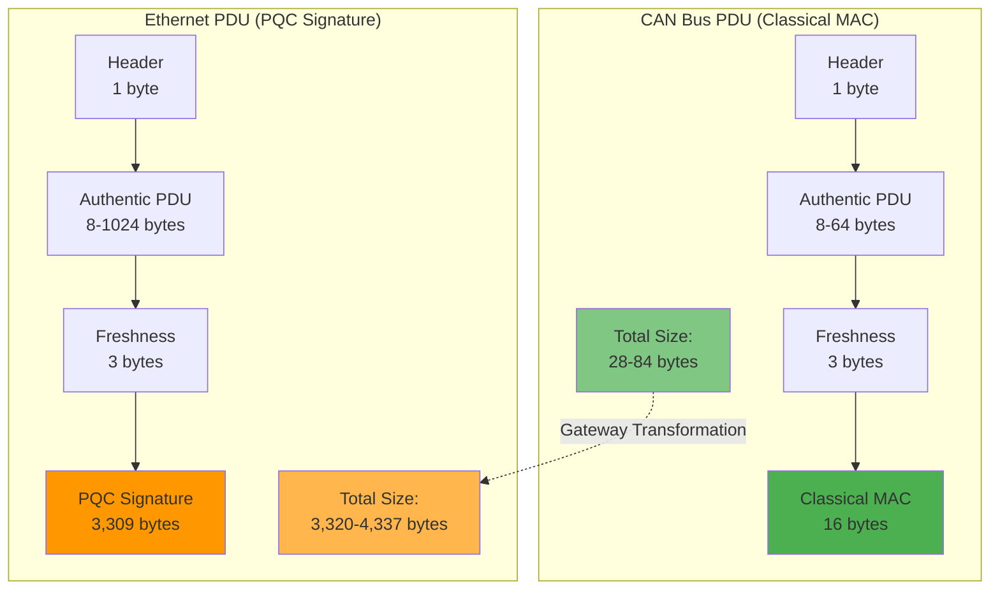

---

## 5. Gateway TX Flow (Detailed Steps)

```mermaid
flowchart TD
    START([CAN Message Arrival]) --> RX_CAN[Receive via MCP2515]
    RX_CAN --> VERIFY_MAC{Verify<br/>Classical MAC}

    VERIFY_MAC -->|Invalid| DROP1[Drop Message]
    DROP1 --> END1([END])

    VERIFY_MAC -->|Valid| EXTRACT[Extract Authentic PDU]
    EXTRACT --> INC_FV[Increment Freshness Counter]
    INC_FV --> BUILD_DTA[Build Data-to-Authenticator<br/>MessageID + Data + Freshness]

    BUILD_DTA --> PQC_SIGN[PQC Signature Generation<br/>ML-DSA-65 Sign]
    Note right of PQC_SIGN: Time: ~8.1ms<br/>Signature: 3,309 bytes

    PQC_SIGN --> BUILD_PDU[Build Secured PDU<br/>Data + Freshness + Signature]
    BUILD_PDU --> ROUTE[Route to Ethernet via PduR]
    ROUTE --> ETH_TX[Ethernet Transmission<br/>TCP Port 12345]
    ETH_TX --> SUCCESS([Message Sent])

    style VERIFY_MAC fill:#ffc107
    style PQC_SIGN fill:#ff9800
    style SUCCESS fill:#4caf50,color:#fff
    style DROP1 fill:#f44336,color:#fff
```

---

## 6. Gateway RX Flow with Security Checks

```mermaid
flowchart TD
    START([Ethernet Message Arrival]) --> RX_ETH[Receive via TCP Socket]
    RX_ETH --> PARSE[Parse Secured PDU<br/>Extract Data, Freshness, Signature]

    PARSE --> CHECK_FV{Freshness Value<br/>> Last Value?}

    CHECK_FV -->|NO| REPLAY[Replay Attack<br/>Detected!]
    REPLAY --> LOG1[Log Security Event]
    LOG1 --> DROP1[Drop PDU]
    DROP1 --> END1([BLOCKED])

    CHECK_FV -->|YES| REBUILD[Rebuild Data-to-Authenticator<br/>MessageID + Data + Freshness]

    REBUILD --> PQC_VERIFY[PQC Signature Verification<br/>ML-DSA-65 Verify]
    Note right of PQC_VERIFY: Time: ~4.9ms

    PQC_VERIFY --> CHECK_SIG{Signature<br/>Valid?}

    CHECK_SIG -->|NO| TAMPER[Tampering<br/>Detected!]
    TAMPER --> LOG2[Log Security Event]
    LOG2 --> DROP2[Drop PDU]
    DROP2 --> END2([BLOCKED])

    CHECK_SIG -->|YES| UPDATE_FV[Update Freshness Counter]
    UPDATE_FV --> EXTRACT[Extract Authentic PDU]
    EXTRACT --> GEN_MAC[Generate Classical MAC<br/>for CAN]
    GEN_MAC --> CAN_TX[Transmit to CAN Bus]
    CAN_TX --> SUCCESS([Message Delivered])

    style CHECK_FV fill:#ffc107
    style PQC_VERIFY fill:#ff9800
    style SUCCESS fill:#4caf50,color:#fff
    style REPLAY fill:#f44336,color:#fff
    style TAMPER fill:#f44336,color:#fff
    style END1 fill:#f44336,color:#fff
    style END2 fill:#f44336,color:#fff
```

---

## 7. Raspberry Pi 4 Gateway Hardware Architecture

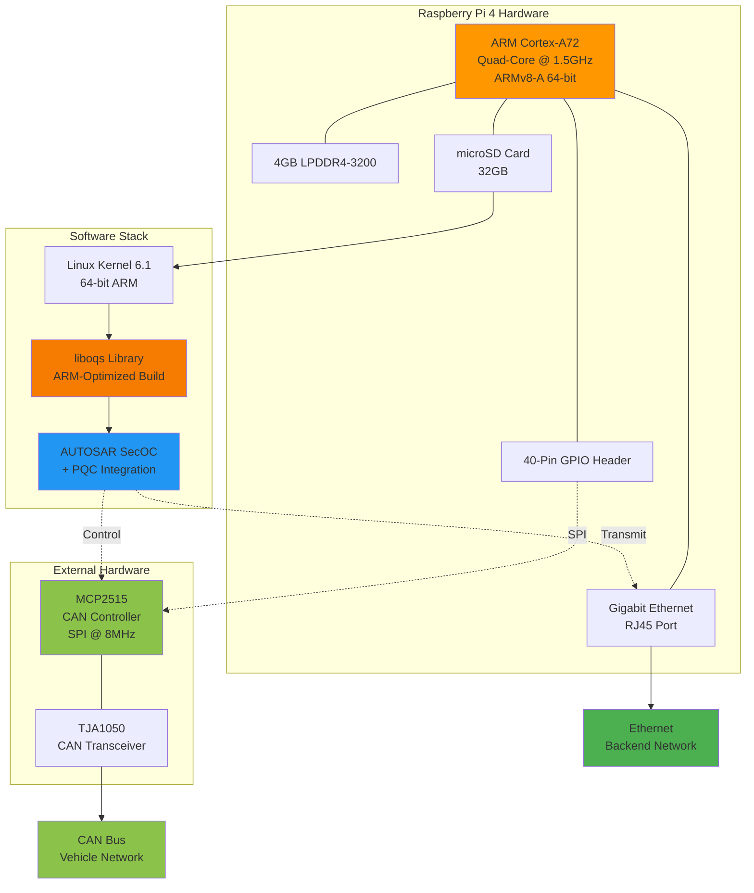

---

## 8. PQC Integration in Gateway

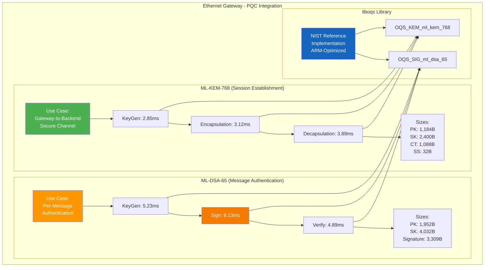

---

## 9. Performance Comparison (Gateway Context)

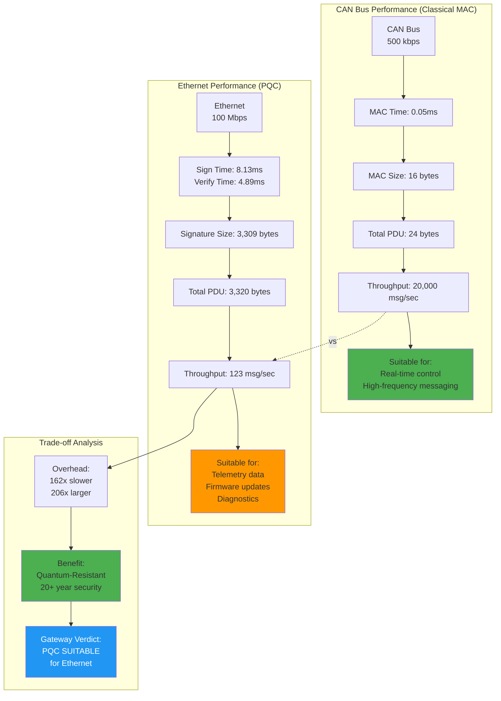

---

## 10. Security Attack Detection Flow

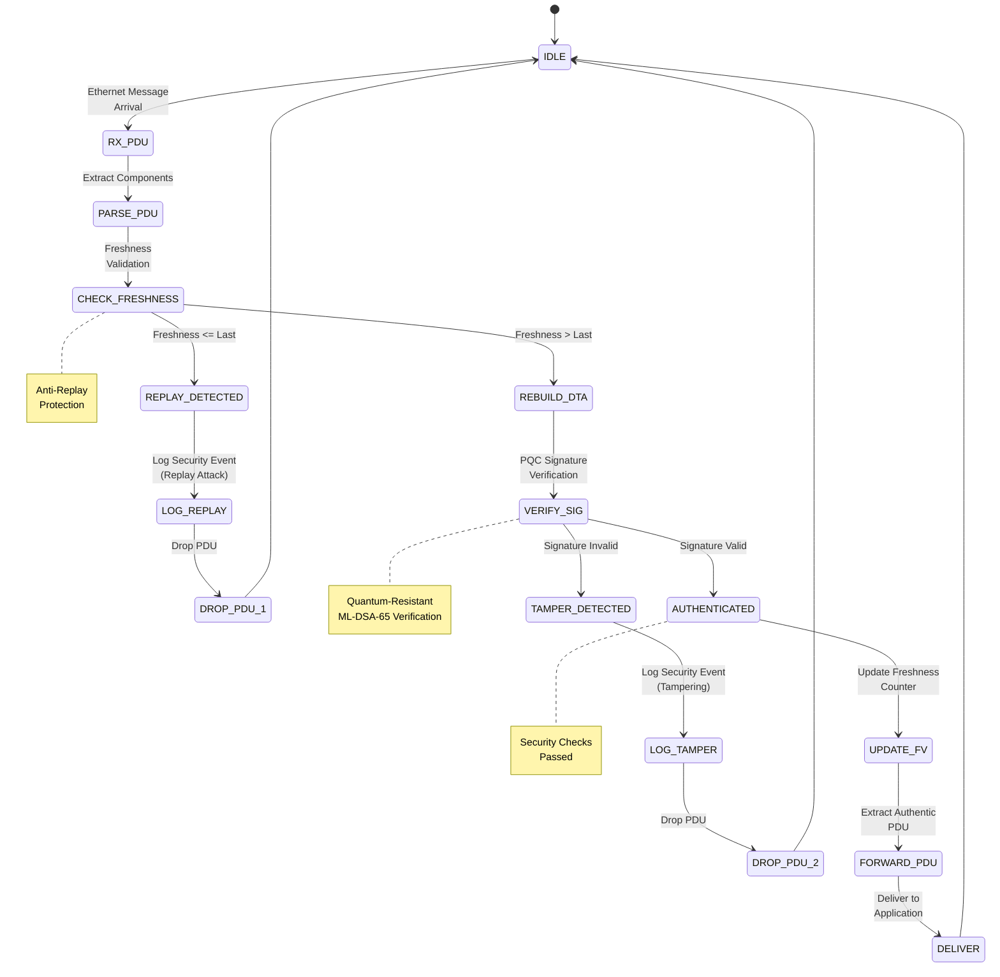

---

## 11. Ethernet Gateway Message Size Evolution

```mermaid
graph LR
    subgraph "Stage 1: Vehicle ECU"
        VEH_DATA[Vehicle Data<br/>8 bytes]
    end

    subgraph "Stage 2: CAN Bus"
        CAN_DATA[8 bytes]
        CAN_MAC[+MAC 16B]
        CAN_TOTAL[Total: 24 bytes]

        CAN_DATA --> CAN_MAC
        CAN_MAC --> CAN_TOTAL
    end

    subgraph "Stage 3: Gateway Processing"
        GW_EXTRACT[Extract 8 bytes]
        GW_FV[+Freshness 4B]
        GW_SIGN[+PQC Sig 3309B]
        GW_TOTAL[Total: 3,321 bytes]

        GW_EXTRACT --> GW_FV
        GW_FV --> GW_SIGN
        GW_SIGN --> GW_TOTAL
    end

    subgraph "Stage 4: Ethernet"
        ETH_PDU[Secured PDU<br/>3,321 bytes]
        ETH_BW[Bandwidth: 100 Mbps]

        ETH_PDU --> ETH_BW
    end

    VEH_DATA -->|CAN Tx| CAN_DATA
    CAN_TOTAL -->|Gateway Rx| GW_EXTRACT
    GW_TOTAL -->|Gateway Tx| ETH_PDU

    style CAN_TOTAL fill:#8bc34a
    style GW_TOTAL fill:#ff9800
    style ETH_BW fill:#4caf50
```

---

## 12. Dual-Platform Architecture

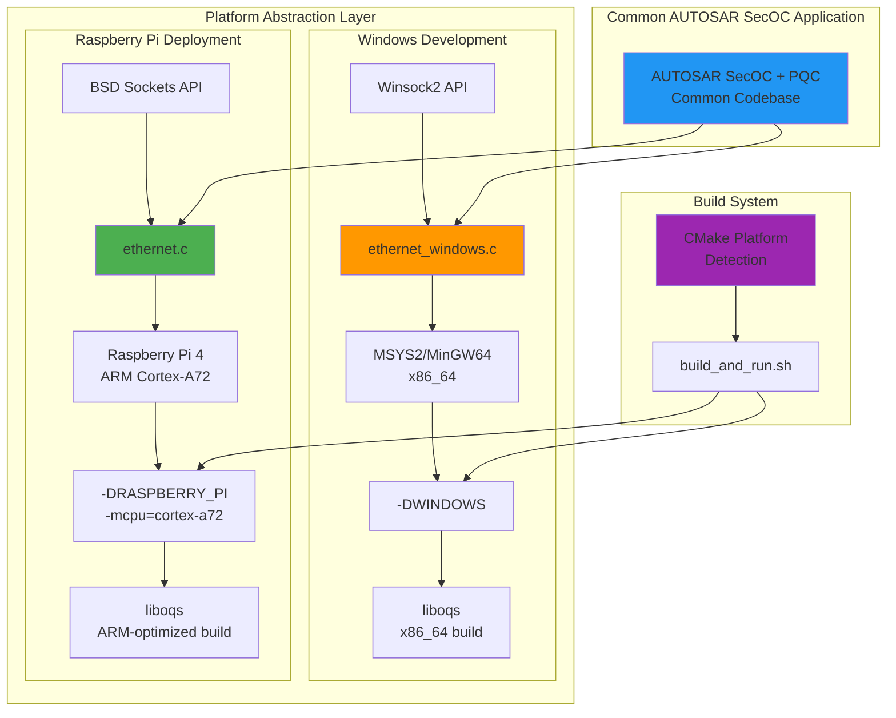

---

## 13. Buffer Overflow Fix Visualization

```mermaid
graph TB
    subgraph "BEFORE - Vulnerable Implementation"
        OLD_DEF["BUS_LENGTH_RECEIVE = 8"]
        OLD_BUF[Buffer Size: 10 bytes<br/>8 data + 2 ID]
        OLD_COPY[memcpy 3,309 bytes into 10-byte buffer]
        OLD_SEND[send only 10 bytes]

        OLD_DEF --> OLD_BUF
        OLD_BUF --> OLD_COPY
        OLD_COPY --> OLD_SEND

        OLD_ISSUE1[Buffer Overflow<br/>Memory Corruption]
        OLD_ISSUE2[Data Truncation<br/>99.7% of signature lost]

        OLD_COPY -.->|DANGER| OLD_ISSUE1
        OLD_SEND -.->|DANGER| OLD_ISSUE2
    end

    subgraph "AFTER - Fixed Implementation"
        NEW_DEF["BUS_LENGTH_RECEIVE = 4096"]
        NEW_BUF[Buffer Size: 4098 bytes<br/>4096 data + 2 ID]
        NEW_COPY[memcpy up to 4096 bytes safely]
        NEW_SEND[send actual length<br/>dataLen + sizeof ID]

        NEW_DEF --> NEW_BUF
        NEW_BUF --> NEW_COPY
        NEW_COPY --> NEW_SEND

        NEW_SAFE1[Safe Buffer<br/>Fits PQC Signature]
        NEW_SAFE2[Complete Transmission<br/>Full signature sent]

        NEW_BUF -.->|SAFE| NEW_SAFE1
        NEW_SEND -.->|SAFE| NEW_SAFE2
    end

    style OLD_ISSUE1 fill:#f44336,color:#fff
    style OLD_ISSUE2 fill:#f44336,color:#fff
    style NEW_SAFE1 fill:#4caf50,color:#fff
    style NEW_SAFE2 fill:#4caf50,color:#fff
```

---

## 14. Freshness Value Management (Anti-Replay)

```mermaid
sequenceDiagram
    participant GW as Gateway
    participant TX as Transmitter
    participant RX as Receiver
    participant FVM as Freshness Value<br/>Manager

    Note over GW,FVM: Normal Communication Flow

    TX->>FVM: Request TX Freshness
    FVM->>FVM: Increment Counter<br/>Counter = 1
    FVM-->>TX: Return Freshness = 1

    TX->>TX: Build Data-to-Authenticator<br/>[MessageID + Data + FV=1]
    TX->>TX: Generate PQC Signature
    TX->>RX: Send Secured PDU (FV=1)

    RX->>RX: Extract Freshness = 1
    RX->>RX: Check: 1 > 0 (last FV)?
    Note over RX: YES - Accept
    RX->>RX: Verify PQC Signature
    RX->>FVM: Update RX Freshness = 1

    Note over GW,FVM: Replay Attack Scenario

    TX->>FVM: Request TX Freshness
    FVM->>FVM: Increment Counter<br/>Counter = 2
    FVM-->>TX: Return Freshness = 2

    TX->>TX: Build Data-to-Authenticator<br/>[MessageID + Data + FV=2]
    TX->>TX: Generate PQC Signature

    Note over TX: Attacker captures PDU

    TX->>RX: Send Secured PDU (FV=2)
    RX->>RX: Check: 2 > 1?
    Note over RX: YES - Accept
    RX->>FVM: Update RX Freshness = 2

    Note over TX,RX: Attacker replays old PDU

    TX->>RX: [ATTACK] Replay PDU (FV=1)
    RX->>RX: Extract Freshness = 1
    RX->>RX: Check: 1 > 2 (last FV)?
    Note over RX: NO - REJECT!
    RX->>RX: Drop PDU
    Note over RX: Replay Attack Detected!

    style RX fill:#f44336,color:#fff
```

---

## 15. Test Suite Architecture

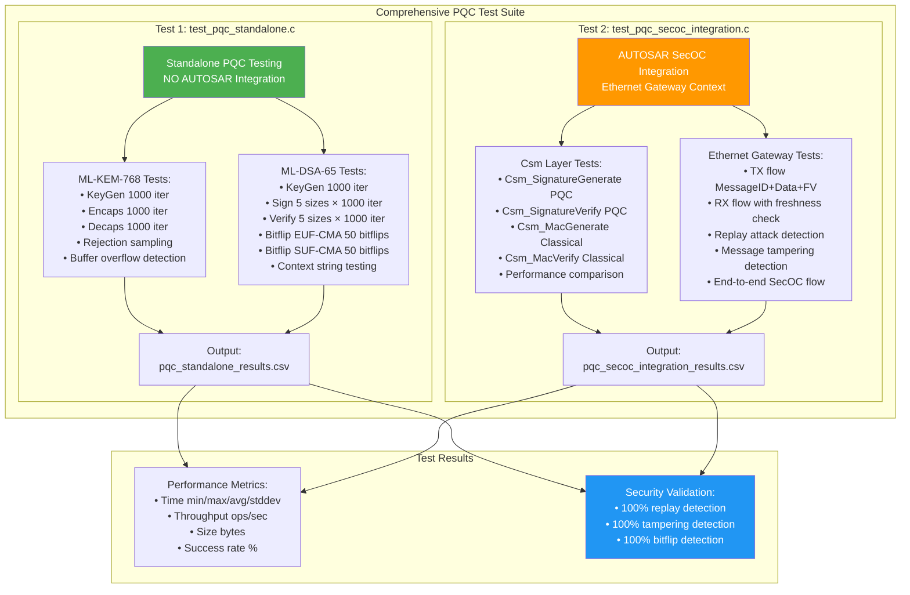

---

## Diagram Summary

| # | Diagram Name | Purpose | Gateway Context |
|---|-------------|---------|----------------|
| 1 | Ethernet Gateway System Overview | High-level architecture | Core gateway topology |
| 2 | Data Flow (CAN → Ethernet) | TX path with PQC signing | CAN to backend transformation |
| 3 | Data Flow (Ethernet → CAN) | RX path with PQC verification | Backend to CAN transformation |
| 4 | Secured PDU Format Comparison | Message structure | Size comparison CAN vs Ethernet |
| 5 | Gateway TX Flow | Detailed transmission steps | PQC signature generation |
| 6 | Gateway RX Flow | Detailed reception with security | Replay & tampering detection |
| 7 | Raspberry Pi 4 Architecture | Hardware deployment | Physical gateway platform |
| 8 | PQC Integration | ML-KEM-768 & ML-DSA-65 | Cryptographic modules |
| 9 | Performance Comparison | CAN vs Ethernet metrics | Suitability analysis |
| 10 | Security Attack Detection | State machine | Attack prevention flow |
| 11 | Message Size Evolution | Size transformation | 8 bytes → 3,321 bytes |
| 12 | Dual-Platform Architecture | Windows & Raspberry Pi | Build system abstraction |
| 13 | Buffer Overflow Fix | Before/after comparison | Critical vulnerability fix |
| 14 | Freshness Management | Anti-replay mechanism | Replay attack prevention |
| 15 | Test Suite Architecture | Comprehensive testing | Both test files coverage |

**Total: 15 diagrams - All focused on Ethernet Gateway with Post-Quantum Cryptography**

---

## How to Use These Diagrams

### In GitHub/GitLab
Simply view the markdown file - Mermaid renders automatically.

### In VS Code
Install extension: "Markdown Preview Mermaid Support"

### Export to Images
Use Mermaid CLI:
```bash
npm install -g @mermaid-js/mermaid-cli
mmdc -i DIAGRAMS.md -o diagrams.pdf
```

### In LaTeX Reports
Convert to SVG/PNG:
```bash
mmdc -i DIAGRAMS.md -o diagram.png
```

---

**Key Features:**
- All diagrams emphasize **Ethernet Gateway** context
- Clear visualization of **CAN ↔ Ethernet** transformation
- **PQC integration** shown in gateway operations
- **Security mechanisms** (replay detection, tampering detection) highlighted
- **Performance trade-offs** between CAN and Ethernet clearly shown
- **Dual-platform** deployment (Windows development → Raspberry Pi deployment)

---

## PHASE 3 COMPLETE: ML-KEM + HKDF + SoAd_PQC Integration Diagrams

### 16. Phase 3 Complete Architecture Overview

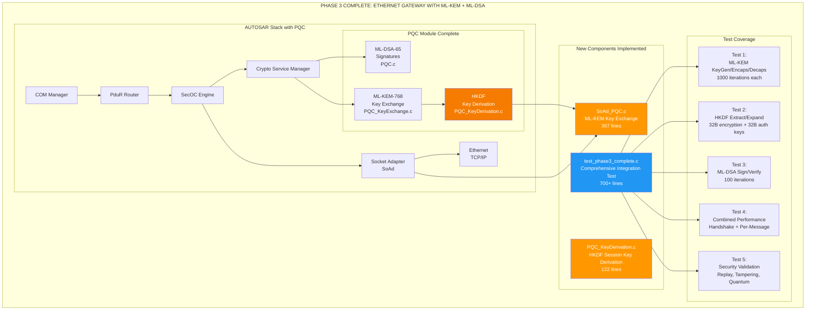

---

### 17. ML-KEM-768 Key Exchange Flow (SoAd_PQC Integration)

```mermaid
sequenceDiagram
    participant Gateway as Ethernet Gateway<br/>(Raspberry Pi)
    participant SoAd as SoAd_PQC Module
    participant PQC_KE as PQC_KeyExchange
    participant PQC_KD as PQC_KeyDerivation
    participant ETH as Ethernet Network
    participant Backend as Central ECU

    Note over Gateway,Backend: ML-KEM-768 SESSION ESTABLISHMENT

    Gateway->>SoAd: SoAd_PQC_KeyExchange(PeerId=0, IsInitiator=TRUE)
    activate SoAd

    SoAd->>SoAd: State = KEY_EXCHANGE_INITIATED

    SoAd->>PQC_KE: PQC_KeyExchange_Initiate(PeerId=0)
    activate PQC_KE

    PQC_KE->>PQC_KE: OQS_KEM_keypair()<br/>Time: 2.85ms
    Note over PQC_KE: Generate ML-KEM-768 keypair<br/>Public: 1184 bytes<br/>Secret: 2400 bytes

    PQC_KE-->>SoAd: Public Key (1184 bytes)
    deactivate PQC_KE

    SoAd->>ETH: ethernet_send(PeerId=0, PublicKey, 1184)
    ETH->>Backend: TCP/IP Port 12345

    Note over Backend: Responder Flow

    Backend->>Backend: ethernet_receive()<br/>Receive Public Key
    Backend->>Backend: PQC_KeyExchange_Respond()
    Backend->>Backend: OQS_KEM_encaps(PublicKey)<br/>Time: 3.12ms
    Note over Backend: Encapsulate<br/>Ciphertext: 1088 bytes<br/>Shared Secret: 32 bytes

    Backend->>ETH: ethernet_send(Ciphertext, 1088)
    ETH->>SoAd: TCP/IP

    SoAd->>SoAd: ethernet_receive()<br/>Ciphertext (1088 bytes)
    SoAd->>SoAd: State = KEY_EXCHANGE_COMPLETED

    SoAd->>PQC_KE: PQC_KeyExchange_Complete(PeerId=0, Ciphertext)
    activate PQC_KE

    PQC_KE->>PQC_KE: OQS_KEM_decaps(Ciphertext)<br/>Time: 3.89ms
    Note over PQC_KE: Decapsulate<br/>Recover Shared Secret: 32 bytes

    PQC_KE-->>SoAd: Shared Secret (32 bytes)
    deactivate PQC_KE

    SoAd->>PQC_KD: PQC_DeriveSessionKeys(SharedSecret, PeerId=0)
    activate PQC_KD

    PQC_KD->>PQC_KD: HKDF-Extract<br/>PRK = HMAC-SHA256(salt, SharedSecret)
    PQC_KD->>PQC_KD: HKDF-Expand<br/>EncryptionKey = HMAC-SHA256(PRK, "Encryption-Key" || 0x01)
    PQC_KD->>PQC_KD: HKDF-Expand<br/>AuthenticationKey = HMAC-SHA256(PRK, "Authentication-Key" || 0x01)
    Note over PQC_KD: Time: 0.3ms

    PQC_KD-->>SoAd: SessionKeys<br/>32B Encryption + 32B Auth
    deactivate PQC_KD

    SoAd->>SoAd: Store PQC_SessionKeys[0]<br/>State = SESSION_ESTABLISHED
    deactivate SoAd

    Note over Gateway,Backend: SESSION READY - Both peers have identical session keys<br/>Total Handshake Time: ~10.16ms (one-time cost)

    style SoAd fill:#ff9800,color:#fff
    style PQC_KE fill:#f57c00,color:#fff
    style PQC_KD fill:#f57c00,color:#fff
```

---

### 18. HKDF Session Key Derivation (Detailed)

```mermaid
graph TB
    subgraph "INPUT"
        SS[ML-KEM Shared Secret<br/>32 bytes<br/>From OQS_KEM_decaps]
        SALT[HKDF Salt<br/>AUTOSAR-SecOC-PQC-v1.0]
        INFO_ENC[Info String: Encryption-Key]
        INFO_AUTH[Info String: Authentication-Key]
    end

    subgraph "HKDF-Extract Phase"
        CONCAT1[Concatenate: Salt || SharedSecret]
        SHA256_1[SHA-256 Hash]
        PRK[Pseudorandom Key PRK<br/>32 bytes]

        SS --> CONCAT1
        SALT --> CONCAT1
        CONCAT1 --> SHA256_1
        SHA256_1 --> PRK
    end

    subgraph "HKDF-Expand Phase Encryption Key"
        CONCAT2[Concatenate: PRK || Info_Enc || 0x01]
        SHA256_2[SHA-256 Hash]
        ENC_KEY[Encryption Key<br/>32 bytes<br/>For AES-256-GCM]

        PRK --> CONCAT2
        INFO_ENC --> CONCAT2
        CONCAT2 --> SHA256_2
        SHA256_2 --> ENC_KEY
    end

    subgraph "HKDF-Expand Phase Authentication Key"
        CONCAT3[Concatenate: PRK || Info_Auth || 0x01]
        SHA256_3[SHA-256 Hash]
        AUTH_KEY[Authentication Key<br/>32 bytes<br/>For HMAC-SHA256]

        PRK --> CONCAT3
        INFO_AUTH --> CONCAT3
        CONCAT3 --> SHA256_3
        SHA256_3 --> AUTH_KEY
    end

    subgraph "OUTPUT: PQC_SessionKeysType"
        SESSION[Session Keys Stored<br/>PQC_SessionKeys PeerId]
        ENC_FINAL[EncryptionKey 32B]
        AUTH_FINAL[AuthenticationKey 32B]
        VALID[IsValid = TRUE]

        ENC_KEY --> ENC_FINAL
        AUTH_KEY --> AUTH_FINAL
        ENC_FINAL --> SESSION
        AUTH_FINAL --> SESSION
        VALID --> SESSION
    end

    subgraph "Security Properties"
        PROP1[Key Independence:<br/>EncKey != AuthKey]
        PROP2[Forward Secrecy:<br/>Different SS -> Different Keys]
        PROP3[Deterministic:<br/>Same SS -> Same Keys]
    end

    SESSION --> PROP1
    SESSION --> PROP2
    SESSION --> PROP3

    style PRK fill:#ff9800
    style ENC_KEY fill:#4caf50
    style AUTH_KEY fill:#2196f3
    style SESSION fill:#f57c00,color:#fff
```

---

### 19. Complete AUTOSAR Signal Flow with Phase 3 Components

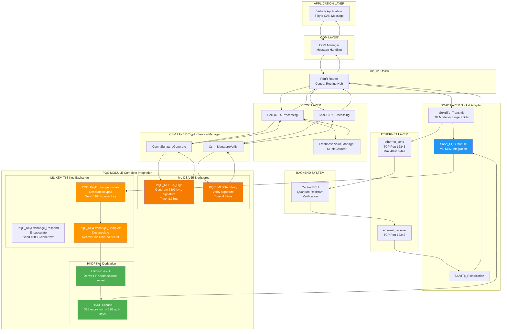

---

### 20. PQC Module Interaction Diagram (Phase 3 Complete)

```mermaid
graph TB
    subgraph "EXTERNAL INTERFACE"
        CSM[Csm Layer]
        SOAD[SoAd Layer]
        ETH[Ethernet ethernet_send/receive]
    end

    subgraph "PQC MODULE ARCHITECTURE"
        subgraph "PQC.c ML-DSA Module"
            MLDSA_INIT[PQC_Init<br/>Initialize liboqs]
            MLDSA_KEYGEN[PQC_MLDSA_KeyGen<br/>1952B public + 4032B secret]
            MLDSA_SIGN[PQC_MLDSA_Sign<br/>3309B signature<br/>8.13ms]
            MLDSA_VERIFY[PQC_MLDSA_Verify<br/>Signature check<br/>4.89ms]
        end

        subgraph "PQC_KeyExchange.c ML-KEM Module"
            KE_INIT_FUNC[PQC_KeyExchange_Init<br/>Initialize 8 peer slots]
            KE_INITIATE[PQC_KeyExchange_Initiate<br/>KeyGen 2.85ms<br/>Store keypair]
            KE_RESPOND[PQC_KeyExchange_Respond<br/>Encaps 3.12ms<br/>Create ciphertext]
            KE_COMPLETE[PQC_KeyExchange_Complete<br/>Decaps 3.89ms<br/>Recover shared secret]
            KE_GET_SS[PQC_KeyExchange_GetSharedSecret<br/>Retrieve 32B shared secret]
        end

        subgraph "PQC_KeyDerivation.c HKDF Module"
            KD_INIT[PQC_KeyDerivation_Init<br/>Initialize session storage]
            KD_DERIVE[PQC_DeriveSessionKeys<br/>HKDF Extract + Expand<br/>0.3ms]
            KD_GET[PQC_GetSessionKeys<br/>Retrieve stored keys]
            KD_CLEAR[PQC_ClearSessionKeys<br/>Clear sensitive data]
        end

        subgraph "liboqs Integration"
            LIBOQS[Open Quantum Safe Library<br/>NIST FIPS 203 + 204]
            OQS_KEM[OQS_KEM_ml_kem_768<br/>KeyGen, Encaps, Decaps]
            OQS_SIG[OQS_SIG_ml_dsa_65<br/>KeyGen, Sign, Verify]
            OQS_SHA[OQS_SHA2_sha256<br/>For HKDF]
        end
    end

    subgraph "SESSION MANAGEMENT"
        SESSION_KEYS[PQC_SessionKeys 8<br/>32B encryption + 32B auth per peer]
        KE_SESSIONS[KE_Sessions 8<br/>Keypairs + Shared Secrets]
    end

    CSM --> MLDSA_SIGN
    CSM --> MLDSA_VERIFY
    SOAD --> KE_INITIATE
    SOAD --> KE_RESPOND
    SOAD --> KE_COMPLETE
    ETH --> SOAD

    MLDSA_INIT --> LIBOQS
    MLDSA_KEYGEN --> OQS_SIG
    MLDSA_SIGN --> OQS_SIG
    MLDSA_VERIFY --> OQS_SIG

    KE_INIT_FUNC --> LIBOQS
    KE_INITIATE --> OQS_KEM
    KE_RESPOND --> OQS_KEM
    KE_COMPLETE --> OQS_KEM
    KE_GET_SS --> KE_SESSIONS

    KE_COMPLETE --> KD_DERIVE
    KD_INIT --> OQS_SHA
    KD_DERIVE --> OQS_SHA
    KD_DERIVE --> SESSION_KEYS
    KD_GET --> SESSION_KEYS

    style MLDSA_SIGN fill:#f57c00,color:#fff
    style KE_COMPLETE fill:#ff9800,color:#fff
    style KD_DERIVE fill:#4caf50,color:#fff
    style LIBOQS fill:#2196f3,color:#fff
    style SESSION_KEYS fill:#9c27b0,color:#fff
```

---

### 21. Phase 3 Test Coverage Map

```mermaid
graph TB
    subgraph "TEST SUITE: test_phase3_complete_ethernet_gateway.c"
        TEST_MAIN[Phase 3 Complete Test Suite<br/>700+ lines comprehensive testing]

        subgraph "TEST 1: ML-KEM-768 Standalone"
            T1_1[1.1: KeyGen 1000 iterations<br/>Verify 1184B public + 2400B secret]
            T1_2[1.2: Encapsulation 1000 iterations<br/>Verify 1088B ciphertext + 32B secret]
            T1_3[1.3: Decapsulation 1000 iterations<br/>Verify shared secret recovery]
            T1_4[1.4: Multi-peer 8 concurrent sessions<br/>Session isolation test]
        end

        subgraph "TEST 2: HKDF Key Derivation"
            T2_1[2.1: HKDF-Extract<br/>PRK from shared secret]
            T2_2[2.2: HKDF-Expand Encryption<br/>32B encryption key]
            T2_3[2.3: HKDF-Expand Authentication<br/>32B authentication key]
            T2_4[2.4: Key Independence<br/>Verify EncKey != AuthKey != SS]
            T2_5[2.5: Deterministic Derivation<br/>Same SS -> Same keys]
        end

        subgraph "TEST 3: ML-DSA-65 Integrated"
            T3_1[3.1: Csm_SignatureGenerate<br/>100 iterations via Csm layer]
            T3_2[3.2: Csm_SignatureVerify<br/>100 iterations]
            T3_3[3.3: Invalid Signature Detection<br/>100 corrupted signatures]
            T3_4[3.4: Performance Measurement<br/>Sign time + Verify time]
        end

        subgraph "TEST 4: Combined Performance"
            T4_1[4.1: Handshake Total Time<br/>KeyGen + Encaps + Decaps]
            T4_2[4.2: HKDF Overhead<br/>Extract + 2x Expand]
            T4_3[4.3: Per-Message Overhead<br/>Sign + Verify]
            T4_4[4.4: Amortized Cost Analysis<br/>Handshake / N messages]
        end

        subgraph "TEST 5: Security Validation"
            T5_1[5.1: Replay Attack Detection<br/>Stale freshness rejection]
            T5_2[5.2: Message Tampering Detection<br/>Modified data rejection]
            T5_3[5.3: Signature Tampering Detection<br/>Corrupted signature rejection]
            T5_4[5.4: Quantum Resistance Validation<br/>NIST FIPS compliance check]
        end
    end

    subgraph "EXPECTED RESULTS"
        PASS_CRITERIA[All Tests Must PASS:<br/>100% Success Rate]
        PERF_METRICS[Performance Metrics:<br/>< 10ms handshake<br/>< 15ms per-message<br/>> 77 msg/sec throughput]
        SEC_METRICS[Security Metrics:<br/>100% attack detection<br/>NIST Category 3 security]
    end

    TEST_MAIN --> T1_1
    TEST_MAIN --> T1_2
    TEST_MAIN --> T1_3
    TEST_MAIN --> T1_4
    TEST_MAIN --> T2_1
    TEST_MAIN --> T2_2
    TEST_MAIN --> T2_3
    TEST_MAIN --> T2_4
    TEST_MAIN --> T2_5
    TEST_MAIN --> T3_1
    TEST_MAIN --> T3_2
    TEST_MAIN --> T3_3
    TEST_MAIN --> T3_4
    TEST_MAIN --> T4_1
    TEST_MAIN --> T4_2
    TEST_MAIN --> T4_3
    TEST_MAIN --> T4_4
    TEST_MAIN --> T5_1
    TEST_MAIN --> T5_2
    TEST_MAIN --> T5_3
    TEST_MAIN --> T5_4

    T1_4 --> PASS_CRITERIA
    T2_5 --> PASS_CRITERIA
    T3_4 --> PERF_METRICS
    T4_4 --> PERF_METRICS
    T5_4 --> SEC_METRICS

    style TEST_MAIN fill:#2196f3,color:#fff
    style PASS_CRITERIA fill:#4caf50,color:#fff
    style PERF_METRICS fill:#ff9800,color:#fff
    style SEC_METRICS fill:#f44336,color:#fff
```

---

## Phase 3 Diagram Summary

| # | Diagram Name | Purpose | New Components Shown |
|---|-------------|---------|---------------------|
| 16 | Phase 3 Complete Architecture | Overall system view | PQC_KeyDerivation, SoAd_PQC, Phase3 Test |
| 17 | ML-KEM Key Exchange Flow | Detailed handshake sequence | SoAd_PQC, PQC_KeyExchange, HKDF integration |
| 18 | HKDF Session Key Derivation | Cryptographic key derivation | HKDF-Extract, HKDF-Expand, Session Keys |
| 19 | Complete AUTOSAR Signal Flow | Full stack with Phase 3 | All PQC modules integrated in AUTOSAR layers |
| 20 | PQC Module Interaction | Internal PQC architecture | PQC.c, PQC_KeyExchange.c, PQC_KeyDerivation.c |
| 21 | Phase 3 Test Coverage | Comprehensive test mapping | All 5 test suites with expected results |

**Total Diagrams: 21** (15 original + 6 Phase 3 diagrams)

---

*END OF DIAGRAMS*
